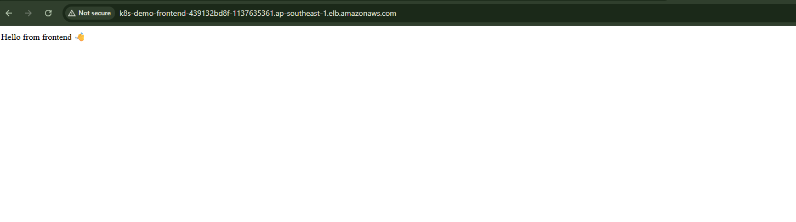
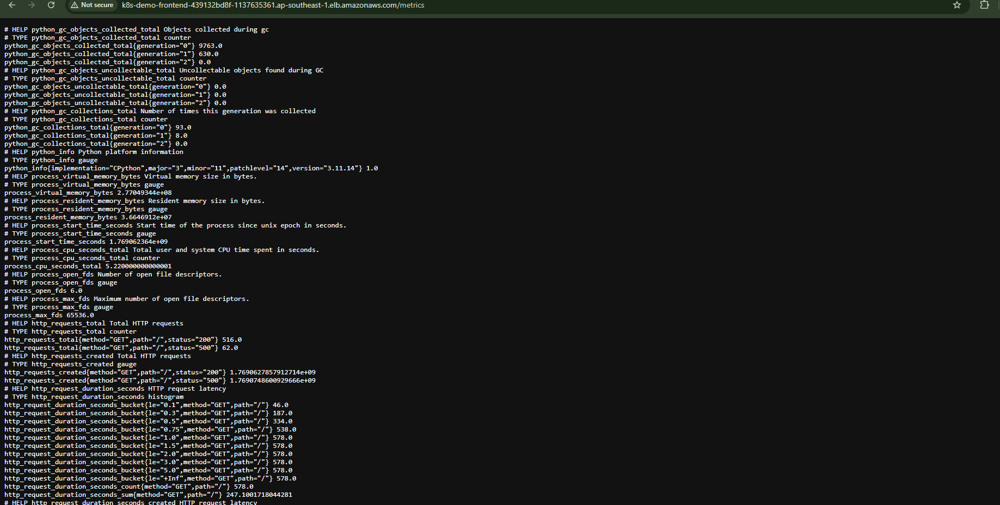
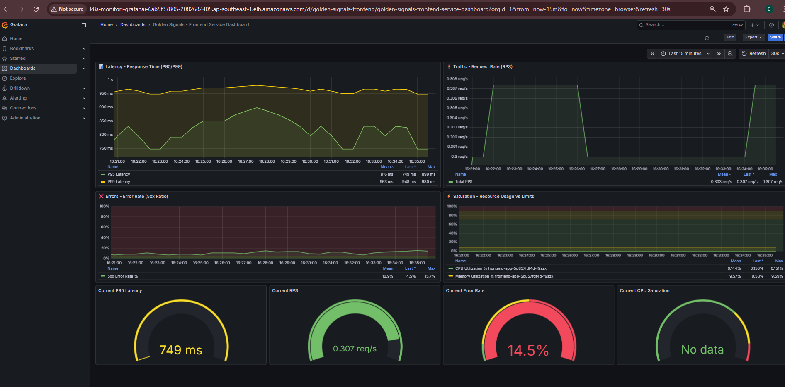

# Kubernetes Monitoring Stack - Complete Setup Guide


# 👉 **[▶️ CLICK HERE TO WATCH THE DEMO VIDEO](./demo-videos.mp4)** 👈


## 📋 Overview

This repository contains a complete Infrastructure as Code (IaC) setup for deploying a production-ready monitoring stack on Amazon EKS. The implementation includes application deployment with ALB Ingress Controller, comprehensive monitoring using Prometheus and Grafana, and centralized logging with Loki and Promtail.

### Architecture Components

- **EKS Cluster**: Amazon Elastic Kubernetes Service cluster named `demo-cluster`
- **AWS Load Balancer Controller**: Manages Application Load Balancers for ingress traffic
- **Application**: Frontend service with Prometheus metrics endpoint
- **Monitoring Stack**: Prometheus + Grafana for metrics collection and visualization
- **Logging Stack**: Loki + Promtail for centralized log aggregation
- **Persistent Storage**: AWS EFS CSI driver for persistent data across pod restarts

### Key Features

- ✅ Golden Signals monitoring dashboard (Latency, Traffic, Errors, Saturation)
- ✅ Automated metrics collection from application `/metrics` endpoints
- ✅ Persistent storage using AWS EFS with ReadWriteMany support
- ✅ ALB-based ingress with automatic provisioning
- ✅ Centralized logging infrastructure
- ✅ Production-ready Helm chart deployments
- ✅ Namespace isolation for applications and monitoring components

---

## 🚀 Quick Start

### Live Demo URLs

| Service | URL |
|---------|-----|
| **Application** | http://k8s-demo-frontend-439132bd8f-1137635361.ap-southeast-1.elb.amazonaws.com |
| **Application Metrics** | http://k8s-demo-frontend-439132bd8f-1137635361.ap-southeast-1.elb.amazonaws.com/metrics |
| **Grafana Dashboard** | http://k8s-monitori-grafanai-6ab5f37805-2082682405.ap-southeast-1.elb.amazonaws.com |
| **Golden Signals Dashboard** | http://k8s-monitori-grafanai-6ab5f37805-2082682405.ap-southeast-1.elb.amazonaws.com/d/golden-signals-frontend/golden-signals-frontend-service-dashboard |

**Grafana Credentials:**
- Username: `admin`
- Password: `admin123`

> **Note**: Currently using default ALB DNS names. SSL/TLS and custom domain integration require domain ownership and SSL certificate setup via AWS Certificate Manager (ACM).

---


you can observe metric of application at /metrics of app url : k8s-demo-frontend-439132bd8f-1137635361.ap-southeast-1.elb.amazonaws.com/metrics




## 📦 Prerequisites

Before starting, ensure you have the following installed and configured:

- ✅ AWS CLI configured with appropriate credentials
- ✅ `kubectl` CLI tool (v1.24+)
- ✅ `eksctl` CLI tool (v0.150+)
- ✅ `helm` v3.x
- ✅ An existing EKS cluster named `demo-cluster` in `ap-southeast-1` region
- ✅ AWS IAM permissions to create policies and service accounts
- ✅ AWS account ID: `380544138214` (update this in commands)

---

## 🔧 Installation Guide

### 1. AWS Load Balancer Controller Setup

The AWS Load Balancer Controller enables automatic ALB provisioning for Kubernetes Ingress resources, replacing the legacy ALB Ingress Controller.

**Working Directory**: `/helm/alb-controller`

#### Step 1: Associate OIDC Provider

Enable IAM roles for service accounts (IRSA) on your EKS cluster:
```bash
eksctl utils associate-iam-oidc-provider \
  --cluster=demo-cluster \
  --approve
```

#### Step 2: Navigate to Working Directory
```bash
cd helm/alb-controller
```

#### Step 3: Apply RBAC Configuration
```bash
kubectl apply -f rbac.yaml -n kube-system
```

#### Step 4: Create IAM Policy

Create the IAM policy that grants necessary permissions to the ALB controller:
```bash
aws iam create-policy \
  --policy-name ALBIngressControllerIAMPolicy \
  --policy-document file://alb-policy.json
```

#### Step 5: Create IAM Service Account

Link the IAM policy to a Kubernetes service account:
```bash
eksctl create iamserviceaccount \
  --cluster=demo-cluster \
  --namespace=kube-system \
  --name=alb-ingress-controller \
  --attach-policy-arn=arn:aws:iam::380544138214:policy/ALBIngressControllerIAMPolicy \
  --override-existing-serviceaccounts \
  --approve
```

> **Note**: The trust role configuration has been modified to allow deployment in namespaces other than `kube-system`.

#### Step 6: Install Helm Chart
```bash
helm install aws-load-balancer-controller \
  eks/aws-load-balancer-controller \
  -n kube-system \
  --values custom-values.yaml
```

#### Verification

Verify the controller is running:
```bash
kubectl get deployment -n kube-system aws-load-balancer-controller
kubectl logs -n kube-system deployment/aws-load-balancer-controller
```

---

### 2. Application Deployment

Deploy the frontend application with automatic ALB provisioning.

**Working Directory**: `/helm/frontend`

#### Step 1: Navigate to Application Directory
```bash
cd helm/frontend
```

#### Step 2: Create Namespace
```bash
kubectl create ns demo
```

#### Step 3: Deploy Application and Ingress
```bash
kubectl apply -f deployment.yaml -f ingress.yaml -n demo
```

This will create:
- **Deployment**: Frontend application pods
- **Service**: ClusterIP service exposing the application
- **Ingress**: Triggers ALB provisioning with health checks

#### Step 4: Wait for ALB Provisioning
```bash
kubectl get ingress -n demo -w
```

Wait until the `ADDRESS` field shows the ALB DNS name (typically takes 2-3 minutes).

#### Accessing the Application

- **Application URL**: http://k8s-demo-frontend-439132bd8f-1137635361.ap-southeast-1.elb.amazonaws.com
- **Metrics Endpoint**: http://k8s-demo-frontend-439132bd8f-1137635361.ap-southeast-1.elb.amazonaws.com/metrics

The `/metrics` endpoint exposes Prometheus-formatted metrics for monitoring.

---

### 3. Persistent Storage Setup (EFS)

AWS Elastic File System (EFS) provides persistent, shared storage for monitoring components. EFS supports `ReadWriteMany` access mode, allowing multiple pods to mount the same volume simultaneously.

**Working Directory**: `/persistent-storage`

#### Why EFS?

- Prevents `CrashLoopBackOff` errors when Grafana restarts
- Supports multiple replicas mounting the same volume
- Prevents "volume already mounted" errors
- Persists dashboards, datasources, and Prometheus data across pod lifecycles

#### Deploy Persistent Volume Claims
```bash
kubectl apply -f persistent-storage/persistent-storage-monitoring.yaml
```

This creates:
- **PVC for Grafana**: Stores dashboards, plugins, and configurations
- **PVC for Prometheus**: Stores time-series metrics data

Both PVCs are backed by the same EFS filesystem with different access points.

#### Verification
```bash
kubectl get pvc -n monitoring
```

Expected output:
```
NAME                STATUS   VOLUME                                     CAPACITY   ACCESS MODES
grafana-storage     Bound    pvc-xxxxx-xxxx-xxxx-xxxx-xxxxxxxxxxxx     10Gi       RWX
prometheus-storage  Bound    pvc-yyyyy-yyyy-yyyy-yyyy-yyyyyyyyyyyy     20Gi       RWX
```

---

### 4. Prometheus and Grafana Setup

Deploy the complete monitoring stack using the kube-prometheus-stack Helm chart.

**Working Directory**: `/helm/monitoring/kube-prometheus-stack`

#### Step 1: Create Monitoring Namespace
```bash
kubectl create ns monitoring
```

#### Step 2: Add Helm Repository
```bash
helm repo add prometheus-community https://prometheus-community.github.io/helm-charts
helm repo update
```

#### Step 3: Install kube-prometheus-stack
```bash
helm install kube-prometheus-stack \
  prometheus-community/kube-prometheus-stack \
  --version 81.2.0 \
  -n monitoring \
  --values helm/monitoring/kube-prometheus-stack/custom-values.yaml
```

This installs:
- **Prometheus Operator**: Manages Prometheus instances
- **Prometheus**: Metrics collection and storage
- **Grafana**: Visualization and dashboarding
- **Alertmanager**: Alert routing and management
- **Node Exporter**: Host-level metrics
- **Kube-State-Metrics**: Kubernetes object metrics
- **Pre-configured dashboards**: For cluster monitoring

#### Step 4: Deploy Grafana Ingress
```bash
kubectl apply -f ingress.yaml -n monitoring
```

This provisions an ALB for Grafana access.

#### Step 5: Wait for ALB Provisioning
```bash
kubectl get ingress -n monitoring -w
```

#### Accessing Grafana

- **URL**: http://k8s-monitori-grafanai-6ab5f37805-2082682405.ap-southeast-1.elb.amazonaws.com
- **Username**: `admin`
- **Password**: `admin123`

#### Prometheus Configuration

- **Internal Prometheus URL**: `http://prometheus-operated.monitoring.svc.cluster.local:9090`
- This is already configured as the default datasource in Grafana

#### Verification
```bash
# Check all monitoring components
kubectl get all -n monitoring

# Check Prometheus targets
kubectl port-forward -n monitoring svc/kube-prometheus-stack-prometheus 9090:9090
# Visit http://localhost:9090/targets

# Check Grafana
kubectl port-forward -n monitoring svc/kube-prometheus-stack-grafana 3000:80
# Visit http://localhost:3000
```

---

### 5. Loki and Promtail Setup (Centralized Logging)

Deploy Loki for log aggregation and Promtail for log collection from all pods.

#### 5.1 Loki Deployment

**Working Directory**: `/helm/monitoring/loki`

##### Step 1: Add Grafana Helm Repository
```bash
helm repo add grafana https://grafana.github.io/helm-charts
helm repo update
```

##### Step 2: Install Loki Distributed
```bash
helm install loki-distributed \
  grafana/loki-distributed \
  --version 0.80.6 \
  -n monitoring
```

Loki components deployed:
- **Distributor**: Receives logs from Promtail
- **Ingester**: Writes logs to storage
- **Querier**: Handles log queries from Grafana
- **Query Frontend**: Query optimization layer

#### 5.2 Promtail Deployment

**Working Directory**: `/helm/monitoring/promtail`

##### Install Promtail
```bash
helm upgrade --install promtail \
  grafana/promtail \
  -f promtail/custom-values.yaml \
  -n monitoring
```

Promtail is deployed as a **DaemonSet**, running on every node to collect logs from all pods.

#### 5.3 Configure Loki in Grafana

1. Login to Grafana
2. Navigate to **Configuration** → **Data Sources**
3. Click **Add data source**
4. Select **Loki**
5. Set URL: `http://loki-distributed-gateway.monitoring.svc.cluster.local`
6. Click **Save & Test**

#### Verification
```bash
# Check Loki components
kubectl get pods -n monitoring | grep loki

# Check Promtail DaemonSet
kubectl get ds -n monitoring promtail

# View Promtail logs
kubectl logs -n monitoring -l app.kubernetes.io/name=promtail --tail=50
```

---

## 📊 Demo & Testing

### Testing the Monitoring Stack

#### Step 1: Generate Traffic

Hit the application URL multiple times to generate metrics:
```bash
# Using curl in a loop
for i in {1..100}; do
  curl http://k8s-demo-frontend-439132bd8f-1137635361.ap-southeast-1.elb.amazonaws.com
  sleep 0.5
done

# Or manually visit the URL and refresh multiple times
```

#### Step 2: View Metrics Endpoint

Check raw Prometheus metrics:
```bash
curl http://k8s-demo-frontend-439132bd8f-1137635361.ap-southeast-1.elb.amazonaws.com/metrics
```

#### Step 3: Access Golden Signals Dashboard

1. Navigate to the Golden Signals Dashboard:
   http://k8s-monitori-grafanai-6ab5f37805-2082682405.ap-southeast-1.elb.amazonaws.com/d/golden-signals-frontend/golden-signals-frontend-service-dashboard

2. Login with credentials:
   - **Username**: `admin`
   - **Password**: `admin123`

3. Observe real-time metrics:
   - **Latency**: Request duration percentiles (p50, p95, p99)
   - **Traffic**: Requests per second (RPS)
   - **Errors**: Error rate and count
   - **Saturation**: CPU and memory utilization

4. Adjust time range and refresh interval:
   - Time range: Last 1 hour
   - Refresh: 30 seconds

---

## 📁 Project Structure
```
.
├── helm/
│   ├── alb-controller/
│   │   ├── rbac.yaml
│   │   ├── alb-policy.json
│   │   └── custom-values.yaml
│   ├── frontend/
│   │   ├── deployment.yaml
│   │   └── ingress.yaml
│   └── monitoring/
│       ├── kube-prometheus-stack/
│       │   ├── custom-values.yaml
│       │   └── ingress.yaml
│       ├── loki/
│       └── promtail/
│           └── custom-values.yaml
└── persistent-storage/
    └── persistent-storage-monitoring.yaml
```

---

## 🔍 Troubleshooting

### ALB Controller Issues
```bash
# Check controller logs
kubectl logs -n kube-system deployment/aws-load-balancer-controller

# Check IAM service account
kubectl describe sa -n kube-system alb-ingress-controller

# Verify OIDC provider
aws eks describe-cluster --name demo-cluster --query "cluster.identity.oidc.issuer"
```

### Ingress Not Creating ALB
```bash
# Check ingress events
kubectl describe ingress -n demo

# Verify ingress class
kubectl get ingressclass

# Check ALB controller events
kubectl get events -n kube-system --sort-by='.lastTimestamp'
```

### Prometheus Not Scraping Metrics
```bash
# Check ServiceMonitor
kubectl get servicemonitor -n demo

# Check Prometheus targets
kubectl port-forward -n monitoring svc/kube-prometheus-stack-prometheus 9090:9090
# Visit http://localhost:9090/targets

# Check Prometheus logs
kubectl logs -n monitoring prometheus-kube-prometheus-stack-prometheus-0
```

### Grafana Dashboard Not Loading
```bash
# Check Grafana pods
kubectl get pods -n monitoring | grep grafana

# Check Grafana logs
kubectl logs -n monitoring deployment/kube-prometheus-stack-grafana

# Verify PVC mount
kubectl describe pod -n monitoring <grafana-pod-name>
```

### Loki Logs Not Appearing
```bash
# Check Promtail status
kubectl get pods -n monitoring | grep promtail

# Check Promtail logs
kubectl logs -n monitoring -l app.kubernetes.io/name=promtail

# Verify Loki components
kubectl get pods -n monitoring | grep loki

# Test Loki datasource in Grafana
# Go to Explore → Select Loki → Run query: {namespace="demo"}
```

---

## 🔐 Security Considerations

### Current Limitations

- ⚠️ Using default ALB DNS (not production-ready)
- ⚠️ No SSL/TLS encryption
- ⚠️ Default Grafana credentials (should be changed)
- ⚠️ No network policies implemented
- ⚠️ Public ALB endpoints (should be internal for production)

### Production Recommendations

1. **SSL/TLS Configuration**
   - Request ACM certificate for your domain
   - Update Ingress annotations with certificate ARN
   - Enable HTTPS redirect

2. **Authentication**
   - Change default Grafana password
   - Enable OAuth/LDAP integration
   - Implement RBAC for Grafana users

3. **Network Security**
   - Implement NetworkPolicies
   - Use internal ALB for monitoring endpoints
   - Enable VPC flow logs

4. **Secrets Management**
   - Use AWS Secrets Manager or External Secrets Operator
   - Rotate credentials regularly
   - Encrypt secrets at rest

5. **Monitoring & Alerting**
   - Configure Alertmanager rules
   - Set up PagerDuty/Slack notifications
   - Create runbooks for common alerts

---

## 🎯 Golden Signals Explained

The dashboard implements Google's Four Golden Signals of monitoring:

### 1. Latency
- **What**: Time to service requests
- **Metrics**: p50, p95, p99 response times
- **Why**: Identifies performance degradation

### 2. Traffic
- **What**: Demand on the system
- **Metrics**: Requests per second (RPS)
- **Why**: Shows usage patterns and load

### 3. Errors
- **What**: Rate of failed requests
- **Metrics**: Error rate, 5xx responses
- **Why**: Indicates service health issues

### 4. Saturation
- **What**: Resource utilization
- **Metrics**: CPU, memory, disk usage
- **Why**: Predicts capacity constraints

---

## 📚 Additional Resources

### Helm Charts Documentation
- [AWS Load Balancer Controller](https://kubernetes-sigs.github.io/aws-load-balancer-controller/)
- [kube-prometheus-stack](https://github.com/prometheus-community/helm-charts/tree/main/charts/kube-prometheus-stack)
- [Loki Distributed](https://grafana.com/docs/loki/latest/setup/install/helm/)
- [Promtail](https://grafana.com/docs/loki/latest/send-data/promtail/)

### AWS Documentation
- [EKS User Guide](https://docs.aws.amazon.com/eks/latest/userguide/)
- [EFS CSI Driver](https://docs.aws.amazon.com/eks/latest/userguide/efs-csi.html)
- [IAM Roles for Service Accounts](https://docs.aws.amazon.com/eks/latest/userguide/iam-roles-for-service-accounts.html)

### Monitoring Best Practices
- [Prometheus Best Practices](https://prometheus.io/docs/practices/)
- [Grafana Dashboarding Best Practices](https://grafana.com/docs/grafana/latest/dashboards/build-dashboards/best-practices/)
- [Google SRE Book - Monitoring Distributed Systems](https://sre.google/sre-book/monitoring-distributed-systems/)

---

## 🤝 Contributing

This is a demonstration project for interview purposes. For production use:

1. Fork the repository
2. Create feature branches
3. Implement security hardening
4. Add comprehensive tests
5. Document infrastructure changes

---

## 📝 Notes

- **AWS Account ID**: Update `380544138214` with your actual AWS account ID
- **Region**: All resources are deployed in `ap-southeast-1`
- **Cluster Name**: Update `demo-cluster` if using a different EKS cluster
- **Domain**: Currently using default ALB DNS; custom domain requires Route53 and ACM setup

---

## ✅ Checklist

Use this checklist to verify your deployment:

- [ ] OIDC provider associated with EKS cluster
- [ ] ALB Controller installed and running
- [ ] Application deployed in `demo` namespace
- [ ] Application accessible via ALB
- [ ] `/metrics` endpoint returning Prometheus metrics
- [ ] EFS PVCs created and bound
- [ ] Prometheus collecting metrics
- [ ] Grafana accessible and logged in
- [ ] Golden Signals dashboard displaying data
- [ ] Loki distributed components running
- [ ] Promtail DaemonSet deployed on all nodes
- [ ] Logs visible in Grafana Explore

---

**Deployment Date**: January 2026  
**Cluster**: demo-cluster (ap-southeast-1)  
**Status**: ✅ Fully Operational
